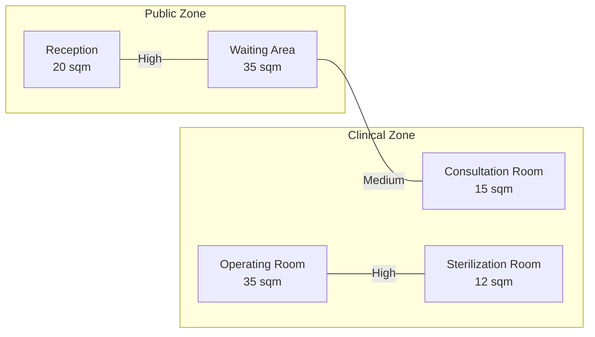

# SpatialSync AI Implementation Guide

## Project

**SpatialSync AI**  
**AI-Assisted Architectural Programming & Spatial Planning Platform**

## Simple Explanation

SpatialSync AI helps an architecture student or designer turn a project brief into a structured programming package.

The app should take this:

```txt
Design a two-storey veterinary clinic with consultation rooms, operating room, pharmacy, laboratory, waiting area, reception, isolation ward, and staff lounge.
```

And help produce this:

1. A room schedule
2. An adjacency matrix
3. A bubble diagram
4. Functional zoning
5. Missing space suggestions
6. AI review notes
7. Exportable Markdown / Mermaid output

The important rule:

> AI should create structured data and recommendations. Normal code should create the diagrams, tables, saving, editing, and exporting.

Do **not** use AI image generation for diagrams. It is expensive, inconsistent, and difficult to edit. The correct approach is:

```txt
Project brief
↓
AI extracts structured JSON
↓
The app stores rooms, adjacencies, zones, and notes
↓
Code renders tables and diagrams from that data
```

For scope questions, product decisions, or anything confusing, Josef should ask **Dustin / project lead** instead of guessing and expanding the app randomly.

---

# 1. MVP Goal

Build a working prototype that shows this workflow:

```txt
Project Brief
↓
AI Brief Analyzer
↓
Editable Room Schedule
↓
AI Adjacency Suggestions
↓
Editable Adjacency Matrix
↓
Code-Generated Bubble Diagram
↓
AI Functional Zoning
↓
AI Layout Review
↓
Markdown / Mermaid Export
```

The MVP is successful if Josef can demo this in 2 to 3 minutes:

1. Paste a project brief.
2. AI extracts spaces and suggested areas.
3. App creates a room schedule.
4. App creates an adjacency matrix.
5. App renders a bubble diagram using React Flow.
6. AI suggests zones and review notes.
7. User exports the result as Markdown and/or Mermaid.

---

# 2. What Makes This Not AI Slop

Bad AI project:

```txt
User asks a question.
AI replies.
Done.
```

SpatialSync AI should be better:

```txt
User gives a project brief.
AI turns it into structured data.
The app transforms that data into real architectural programming outputs.
The user edits the outputs.
The app keeps the outputs connected.
```

AI is only one part of the system.

## AI Handles

- Reading project briefs
- Extracting building type
- Suggesting rooms
- Estimating room areas
- Suggesting adjacency relationships
- Explaining adjacency reasons
- Suggesting missing spaces
- Suggesting functional zones
- Reviewing the layout
- Interpreting optional natural language edits later

## Normal Code Handles

- Forms
- Tables
- Saving projects
- Editing rooms
- Editing adjacency values
- Rendering the matrix
- Rendering the bubble diagram
- Dragging diagram nodes
- Exporting Markdown
- Exporting Mermaid text
- Keeping the data model consistent

Interview line:

```txt
This project separates AI interpretation from deterministic software logic. AI generates structured recommendations, while the application controls the data model, synchronization, diagrams, editing, and export system.
```

---

# 3. Recommended Tech Stack

Use a **Next.js monolith**.

That means frontend and backend live in one project.

## Core Stack

```txt
Framework: Next.js App Router
Language: TypeScript
Styling: Tailwind CSS
AI: OpenAI through Vercel AI SDK provider
Schema validation: Zod
Diagram canvas: React Flow
Graph layout: Dagre or simple custom layout
Database: Supabase PostgreSQL, optional for MVP
Export: Markdown first, Mermaid optional
Deployment: Vercel
```

## Why This Stack

Next.js keeps frontend pages and backend API routes in one app.

OpenAI provider handles AI calls.

Zod helps force AI output into predictable JSON.

React Flow handles the interactive node/bubble diagram.

Dagre or a custom layout places nodes automatically.

Mermaid is useful for export, but it should not be the main interactive workspace.

---

# 4. Very Important Diagram Decision

## Do Not Generate Diagram Images With AI

Do not do this:

```txt
Project brief → AI image generation → bubble diagram PNG
```

Problems:

- expensive
- inconsistent
- hard to edit
- hard to connect back to the room schedule
- hard to update when room data changes
- bad for demos because outputs can look random

## Correct Diagram Strategy

Do this instead:

```txt
Project brief
↓
AI produces JSON
↓
Code creates nodes and edges
↓
React Flow renders the bubble diagram
```

Example:

```json
{
  "rooms": [
    {
      "name": "Reception",
      "areaSqm": 20,
      "zone": "Public",
      "department": "Front of House"
    },
    {
      "name": "Operating Room",
      "areaSqm": 35,
      "zone": "Clinical",
      "department": "Surgery"
    }
  ],
  "adjacencies": [
    {
      "from": "Operating Room",
      "to": "Sterilization Room",
      "strength": "high",
      "reason": "These spaces support surgical workflow and should be near each other."
    }
  ]
}
```

The app uses that JSON to render:

- room schedule
- matrix
- bubble diagram
- zoning list
- export

This is the clean architecture.

---

# 5. MVP Diagram System

## Main Visual Tool: React Flow

Use React Flow for the main bubble diagram.

Each room becomes a node.

Each adjacency becomes an edge.

Example mapping:

```txt
Room → React Flow node
Adjacency → React Flow edge
Zone → node group or node color/category
Area → bubble size
Adjacency strength → edge thickness / distance / label
```

## Node Example

```ts
const nodes = rooms.map((room) => ({
  id: room.id,
  type: "roomNode",
  position: room.position ?? { x: 0, y: 0 },
  data: {
    label: room.name,
    areaSqm: room.areaSqm,
    zone: room.zone,
    department: room.department,
  },
}));
```

## Edge Example

```ts
const edges = adjacencies.map((adjacency) => ({
  id: `${adjacency.fromRoomId}-${adjacency.toRoomId}`,
  source: adjacency.fromRoomId,
  target: adjacency.toRoomId,
  label: adjacency.strength,
  data: {
    strength: adjacency.strength,
    reason: adjacency.reason,
  },
}));
```

## MVP Layout Strategy

Do not over-engineer the layout.

Use one of these:

### Option A: Zone-Based Grid Layout

This is easiest.

```txt
Public zone       Clinical zone       Staff zone       Service zone
Reception         Consultation        Staff Lounge     Storage
Waiting           Operating Room      Office           Mechanical
Lobby             Laboratory          Pantry           Utility
```

Pros:

- simple
- easy to explain
- predictable
- good enough for demo

Cons:

- not a true force-directed bubble diagram

### Option B: React Flow + Dagre

Use Dagre to automatically position nodes based on edges.

Pros:

- looks more diagram-like
- can be re-run after matrix changes
- still manageable

Cons:

- may need tweaking
- not always spatially perfect

### Best MVP Choice

Start with **zone-based layout**. Add Dagre only after the core workflow works.

---

# 6. Mermaid Export Strategy

Mermaid is good for export and documentation.

Use it to generate text-based diagrams from the project data.

Do **not** use Mermaid as the main interactive editor.

## Example Mermaid Export



## App Feature

Add an export button:

```txt
Export Mermaid Diagram
```

It should generate Mermaid text that the user can copy into a Markdown file or Mermaid editor.

This gives Josef a clean demo without needing image generation.

---

# 7. Python Script Strategy

Python can be useful later, but not for the core MVP.

## Use Python Later For

- static PNG export
- prettier generated graph images
- offline experiments
- NetworkX graph layout
- report generation

## Do Not Use Python First For

- the main web app
- the first bubble diagram
- the first export
- basic MVP demo

Why?

Because adding Python means adding another runtime, deployment problem, and backend layer.

For the MVP, keep everything inside Next.js.

Later, Josef can add a Python script like:

```txt
project-data.json → Python script → graph.png
```

But not now.

---

# 8. Core Data Models

Use these data structures even if there is no real database yet.

## Project

```ts
type Project = {
  id: string;
  name: string;
  brief: string;
  buildingType?: string;
  createdAt: string;
  updatedAt: string;
};
```

## Room

```ts
type Room = {
  id: string;
  projectId: string;
  name: string;
  areaSqm: number;
  zone: string;
  department: string;
  priority: "low" | "medium" | "high";
  notes?: string;
  position?: {
    x: number;
    y: number;
  };
};
```

## Adjacency

```ts
type Adjacency = {
  id: string;
  projectId: string;
  fromRoomId: string;
  toRoomId: string;
  strength: "avoid" | "low" | "medium" | "high";
  reason: string;
};
```

## Zone

```ts
type Zone = {
  id: string;
  projectId: string;
  name: string;
  description: string;
  roomIds: string[];
};
```

## Review Note

```ts
type ReviewNote = {
  id: string;
  projectId: string;
  severity: "info" | "warning" | "critical";
  message: string;
  relatedRoomIds?: string[];
};
```

---

# 9. Pages To Build

## Page 1: Landing Page

Route:

```txt
/
```

Purpose:

Explain the app simply.

Sections:

- app name
- tagline
- what it does
- sample workflow
- start button

Example tagline:

```txt
Turn architectural briefs into room schedules, adjacency matrices, zoning notes, and bubble diagrams.
```

---

## Page 2: New Project Page

Route:

```txt
/projects/new
```

Purpose:

User pastes a project brief.

Fields:

- project name
- project brief

Button:

```txt
Analyze Brief
```

When clicked:

- send brief to `/api/analyze-brief`
- receive structured JSON
- show extracted room schedule

---

## Page 3: Project Workspace

Route:

```txt
/projects/[id]
```

Purpose:

Main workspace.

Tabs:

1. Brief
2. Room Schedule
3. Adjacency Matrix
4. Bubble Diagram
5. Zoning
6. Review
7. Export

This is the main app.

---

# 10. API Routes

Use Next.js Route Handlers.

## Analyze Brief

Route:

```txt
POST /api/analyze-brief
```

Input:

```json
{
  "brief": "Design a two-storey veterinary clinic..."
}
```

Output:

```json
{
  "buildingType": "Veterinary Clinic",
  "summary": "A two-storey veterinary clinic with public, clinical, staff, and service spaces.",
  "rooms": [
    {
      "name": "Reception",
      "areaSqm": 20,
      "zone": "Public",
      "department": "Front of House",
      "priority": "high",
      "notes": "First point of contact for visitors."
    }
  ],
  "specialConsiderations": [
    "Separate public and clinical circulation where possible.",
    "Isolation ward should avoid direct contact with public areas."
  ],
  "assumptions": [
    "Room areas are preliminary and should be checked by a licensed professional."
  ]
}
```

---

## Generate Adjacencies

Route:

```txt
POST /api/generate-adjacencies
```

Input:

```json
{
  "buildingType": "Veterinary Clinic",
  "rooms": [
    { "id": "room_1", "name": "Reception", "zone": "Public" },
    { "id": "room_2", "name": "Waiting Area", "zone": "Public" }
  ]
}
```

Output:

```json
{
  "adjacencies": [
    {
      "fromRoomName": "Reception",
      "toRoomName": "Waiting Area",
      "strength": "high",
      "reason": "Visitors should move easily from reception to waiting."
    }
  ]
}
```

Important:

After receiving this, the app should convert room names into room IDs.

---

## Generate Zoning

Route:

```txt
POST /api/generate-zoning
```

Input:

```json
{
  "buildingType": "Veterinary Clinic",
  "rooms": [],
  "adjacencies": []
}
```

Output:

```json
{
  "zones": [
    {
      "name": "Public Zone",
      "description": "Spaces accessible to clients and visitors.",
      "roomNames": ["Reception", "Waiting Area", "Lobby"]
    },
    {
      "name": "Clinical Zone",
      "description": "Spaces used for consultation, treatment, and medical procedures.",
      "roomNames": ["Consultation Room", "Operating Room", "Laboratory"]
    }
  ]
}
```

---

## Review Layout

Route:

```txt
POST /api/review-layout
```

Input:

```json
{
  "buildingType": "Veterinary Clinic",
  "rooms": [],
  "adjacencies": [],
  "nodePositions": []
}
```

Output:

```json
{
  "reviewNotes": [
    {
      "severity": "warning",
      "message": "Isolation Ward should be separated from high-traffic public areas.",
      "relatedRoomNames": ["Isolation Ward", "Waiting Area"]
    }
  ],
  "missingSpaces": [
    {
      "name": "Clean Utility",
      "reason": "Common support space in clinical facilities."
    }
  ]
}
```

---

# 11. AI Implementation

Use structured outputs. Do not ask the AI for paragraphs only.

## Install Packages

```bash
npm install ai @ai-sdk/openai zod
```

## Environment Variable

Create `.env.local`:

```env
OPENAI_API_KEY=your_key_here
```

Never put the API key in frontend code.

## Example AI Route

File:

```txt
app/api/analyze-brief/route.ts
```

Example:

```ts
import { generateObject } from "ai";
import { openai } from "@ai-sdk/openai";
import { z } from "zod";

const RoomSchema = z.object({
  name: z.string(),
  areaSqm: z.number(),
  zone: z.string(),
  department: z.string(),
  priority: z.enum(["low", "medium", "high"]),
  notes: z.string(),
});

const BriefAnalysisSchema = z.object({
  buildingType: z.string(),
  summary: z.string(),
  rooms: z.array(RoomSchema),
  specialConsiderations: z.array(z.string()),
  assumptions: z.array(z.string()),
});

export async function POST(req: Request) {
  const { brief } = await req.json();

  const result = await generateObject({
    model: openai("gpt-4.1-mini"),
    schema: BriefAnalysisSchema,
    prompt: `
You are an architectural programming assistant.

Analyze the project brief and extract a preliminary architectural program.

Rules:
- Return realistic but preliminary room suggestions.
- Do not claim code compliance.
- Do not claim professional approval.
- Include assumptions when information is missing.
- Keep areas in square meters.

Project brief:
${brief}
    `,
  });

  return Response.json(result.object);
}
```

## Important AI Rule

Every AI route should return JSON.

Bad:

```txt
Here are some rooms you might need...
```

Good:

```json
{
  "rooms": [],
  "adjacencies": [],
  "notes": []
}
```

---

# 12. Room Schedule Implementation

The room schedule is just a table.

Columns:

```txt
Room Name
Area sqm
Zone
Department
Priority
Notes
Actions
```

Actions:

- edit room
- delete room
- add room

When a room changes, the matrix and diagram should use the updated room list.

MVP rule:

```txt
Room schedule is the source of truth for spaces.
```

If a room is deleted, remove all adjacencies connected to it.

---

# 13. Adjacency Matrix Implementation

The matrix shows room-to-room relationships.

Strength values:

```txt
avoid
low
medium
high
```

Example:

| Space | Reception | Waiting | Operating | Sterilization |
|---|---|---|---|---|
| Reception | - | High | Low | Avoid |
| Waiting | High | - | Medium | Avoid |
| Operating | Low | Medium | - | High |
| Sterilization | Avoid | Avoid | High | - |

Rules:

- The matrix is symmetrical.
- If A to B is High, B to A should also be High.
- A room does not need adjacency with itself.
- The user can manually change values.
- Manual edits should override AI suggestions.

Implementation note:

Store adjacencies as a list, not a giant matrix.

```ts
const adjacency = {
  fromRoomId: "reception",
  toRoomId: "waiting",
  strength: "high",
  reason: "Visitors should move directly from reception to waiting.",
};
```

Then generate the matrix table from the list.

---

# 14. Bubble Diagram Implementation

The bubble diagram is generated from rooms and adjacencies.

## Data Conversion

```txt
rooms → nodes
adjacencies → edges
zones → node groups/categories
```

## Bubble Size

Use room area to affect visual size.

Simple formula:

```ts
const bubbleSize = Math.max(80, Math.min(180, room.areaSqm * 2));
```

Meaning:

- minimum bubble size: 80
- maximum bubble size: 180
- larger rooms look bigger

## Edge Style

Use adjacency strength to affect edge style.

```ts
const strengthToStrokeWidth = {
  avoid: 1,
  low: 1,
  medium: 2,
  high: 4,
};
```

Optional:

```ts
const strengthToDistance = {
  high: 120,
  medium: 220,
  low: 340,
  avoid: 500,
};
```

For MVP, edge thickness is enough.

## Dragging Nodes

Users should be able to drag bubbles.

When the user drags a node, save its position.

Do not automatically rewrite the matrix at first.

Better MVP behavior:

```txt
If two spaces are dragged very close together, show a suggestion:
"These rooms are close. Update adjacency to High?"
```

If user accepts, update the matrix.

If user ignores, do nothing.

This is safer than pretending the app has a perfect bidirectional sync engine.

---

# 15. Synchronization Rules

Use simple synchronization for MVP.

## Room Schedule → Everything Else

When room schedule changes:

- matrix updates its room rows and columns
- diagram updates its nodes
- export updates its content

## Matrix → Bubble Diagram

When adjacency strength changes:

- edge label updates
- edge thickness updates
- optional auto-layout can be re-run

## Bubble Diagram → Matrix

MVP should not auto-update the matrix.

Instead:

```txt
Dragging rooms close together creates a suggestion.
User chooses Accept or Ignore.
```

This is honest and demo-friendly.

Interview line:

```txt
The MVP uses controlled synchronization. Room schedule and matrix changes update the diagram immediately. Drag-based matrix updates are handled through suggestions so the user remains in control.
```

---

# 16. Layout Algorithm Options

## Option A: Simple Zone Layout

Recommended first.

Pseudo-code:

```ts
const zoneOrder = ["Public", "Semi-Public", "Clinical", "Private", "Service", "Staff"];

function layoutByZone(rooms) {
  const grouped = groupRoomsByZone(rooms);
  const nodes = [];

  zoneOrder.forEach((zone, zoneIndex) => {
    const zoneRooms = grouped[zone] ?? [];

    zoneRooms.forEach((room, roomIndex) => {
      nodes.push({
        id: room.id,
        position: {
          x: zoneIndex * 320,
          y: roomIndex * 180,
        },
        data: room,
      });
    });
  });

  return nodes;
}
```

## Option B: Dagre Layout

Use this after the simple version works.

Dagre is better for connected graphs.

Pseudo-flow:

```txt
rooms + adjacencies
↓
convert to Dagre graph
↓
Dagre calculates x/y positions
↓
convert back to React Flow nodes
```

## Option C: Python NetworkX

Only later.

Useful for static PNG export, not first web demo.

---

# 17. Export System

Start with Markdown export.

## Markdown Export Should Include

1. Project name
2. Original brief
3. Building type
4. Room schedule table
5. Adjacency list
6. Zoning summary
7. Review notes
8. Mermaid diagram code

Example:

```md
# SpatialSync AI Export

## Project Brief

Design a two-storey veterinary clinic...

## Room Schedule

| Room | Area sqm | Zone | Department |
|---|---:|---|---|
| Reception | 20 | Public | Front of House |
| Operating Room | 35 | Clinical | Surgery |

## Key Adjacencies

- Operating Room ↔ Sterilization Room: High
  - Reason: These spaces support surgical workflow.

## Mermaid Diagram

\```mermaid
flowchart LR
  Reception ---|High| Waiting
  Operating ---|High| Sterilization
\```
```

PDF export can come later.

---

# 18. Optional Database

For the simplest demo, Josef can start with local state or localStorage.

But for stronger proof, use Supabase.

## Supabase Tables

### projects

```sql
create table projects (
  id uuid primary key default gen_random_uuid(),
  name text not null,
  brief text not null,
  building_type text,
  created_at timestamp with time zone default now(),
  updated_at timestamp with time zone default now()
);
```

### rooms

```sql
create table rooms (
  id uuid primary key default gen_random_uuid(),
  project_id uuid references projects(id) on delete cascade,
  name text not null,
  area_sqm numeric not null,
  zone text,
  department text,
  priority text,
  notes text,
  position_x numeric,
  position_y numeric,
  created_at timestamp with time zone default now()
);
```

### adjacencies

```sql
create table adjacencies (
  id uuid primary key default gen_random_uuid(),
  project_id uuid references projects(id) on delete cascade,
  from_room_id uuid references rooms(id) on delete cascade,
  to_room_id uuid references rooms(id) on delete cascade,
  strength text not null,
  reason text,
  created_at timestamp with time zone default now()
);
```

### review_notes

```sql
create table review_notes (
  id uuid primary key default gen_random_uuid(),
  project_id uuid references projects(id) on delete cascade,
  severity text not null,
  message text not null,
  created_at timestamp with time zone default now()
);
```

---

# 19. Build Order

Follow this order. Do not skip around like a caffeinated squirrel with a blueprint tube.

## Phase 1: Create the App

```bash
npx create-next-app@latest spatialsync-ai
cd spatialsync-ai
npm install ai @ai-sdk/openai zod @xyflow/react dagre
```

Add Tailwind when asked during setup.

Create `.env.local`:

```env
OPENAI_API_KEY=your_key_here
```

---

## Phase 2: Static UI With Fake Data

Build the workspace with fake room data first.

Pages:

```txt
/
/projects/new
/projects/demo
```

Fake data:

```ts
const demoRooms = [
  { id: "reception", name: "Reception", areaSqm: 20, zone: "Public" },
  { id: "waiting", name: "Waiting Area", areaSqm: 35, zone: "Public" },
  { id: "operating", name: "Operating Room", areaSqm: 35, zone: "Clinical" },
  { id: "sterilization", name: "Sterilization Room", areaSqm: 12, zone: "Clinical" },
];
```

Goal:

The app should look real before AI is connected.

---

## Phase 3: Room Schedule

Build editable table.

User can:

- add room
- edit room
- delete room
- change area
- change zone

---

## Phase 4: Adjacency Matrix

Generate matrix from rooms.

User can change relationship values.

Values:

```txt
avoid, low, medium, high
```

---

## Phase 5: Bubble Diagram

Install and use React Flow.

Render:

- one node per room
- one edge per adjacency
- edge label shows strength
- node size based on area

Use simple zone layout first.

---

## Phase 6: AI Brief Analyzer

Create `/api/analyze-brief`.

Make AI return structured JSON.

Show extracted rooms in the schedule.

---

## Phase 7: AI Adjacency Generator

Create `/api/generate-adjacencies`.

Use room list as input.

Return adjacency suggestions.

User should be able to accept them.

---

## Phase 8: AI Zoning + Review

Create:

```txt
/api/generate-zoning
/api/review-layout
```

Display outputs in the Zoning and Review tabs.

---

## Phase 9: Export

Add export buttons:

```txt
Copy Markdown Export
Copy Mermaid Diagram
Download .md File
```

Markdown export is enough.

---

## Phase 10: Polish Demo

Add:

- sample veterinary clinic brief
- clean empty states
- loading indicators
- error messages
- demo explanation
- README
- screenshots

---

# 20. What Not To Build Yet

Do not build these unless Dustin / project lead says so:

- AI image generation
- real CAD/Revit integration
- full bidirectional sync engine
- advanced force-directed physics
- PDF upload parsing
- OCR
- multi-user collaboration
- authentication system
- payment system
- full PDF export
- Python backend
- FastAPI backend
- perfect code compliance checker
- professional architectural approval claims

These are future features.

---

# 21. Safety and Accuracy Rules

The app must not claim to replace architects.

Use language like:

```txt
Preliminary suggestion
Design aid
Programming assistant
For review
Requires professional verification
```

Avoid language like:

```txt
Approved layout
Code-compliant design
Guaranteed correct
Professional certification
```

Add disclaimer in the app:

```txt
SpatialSync AI provides preliminary architectural programming suggestions. Outputs should be reviewed and verified by a qualified professional before use in real projects.
```

---

# 22. Demo Brief

Use this sample brief for testing:

```txt
Design a two-storey veterinary clinic with consultation rooms, an operating room, pharmacy, laboratory, waiting area, reception, isolation ward, grooming area, staff lounge, storage, and administrative office. The clinic should separate public client areas from clinical and service spaces. The isolation ward should be away from high-traffic public areas. The design should support efficient patient flow from reception to consultation and treatment.
```

Expected rooms:

```txt
Reception
Waiting Area
Consultation Room
Operating Room
Pharmacy
Laboratory
Isolation Ward
Grooming Area
Staff Lounge
Storage
Administrative Office
Toilet
Clean Utility
Dirty Utility
Mechanical Room
```

---

# 23. README Structure

Use this README outline:

```md
# SpatialSync AI

AI-assisted architectural programming and spatial planning platform.

## What It Does

SpatialSync AI helps users turn project briefs into room schedules, adjacency matrices, bubble diagrams, zoning notes, and layout review comments.

## Features

- AI project brief analyzer
- Editable room schedule
- AI-generated adjacency matrix
- React Flow bubble diagram
- Functional zoning suggestions
- Missing space detection
- Layout review notes
- Markdown / Mermaid export

## Tech Stack

- Next.js
- TypeScript
- Tailwind CSS
- OpenAI provider through Vercel AI SDK
- React Flow
- Dagre or custom layout
- Supabase optional

## How It Works

The AI extracts structured JSON from a project brief. The application uses that JSON to generate editable programming artifacts: room schedules, adjacency matrices, and bubble diagrams. Diagrams are rendered by code, not image generation.

## How To Run

```bash
npm install
npm run dev
```

Create `.env.local`:

```env
OPENAI_API_KEY=your_key_here
```

## Future Improvements

- PDF export
- PNG export
- better graph layout
- project history
- authentication
- collaboration
- CAD/Revit export
```

---

# 24. Presentation Script

Josef can use this when explaining the project:

```txt
This is SpatialSync AI, an AI-assisted architectural programming platform.

The app helps turn a project brief into structured programming outputs like room schedules, adjacency matrices, bubble diagrams, zoning notes, and layout review comments.

The important part is that the project does not use AI to generate images. The AI only extracts and recommends structured data. The software then renders the room schedule, matrix, and bubble diagram from that data.

The app is built as a Next.js monolith. It uses server-side API routes for OpenAI calls, React Flow for the interactive bubble diagram, and a simple data model for rooms, adjacencies, zones, and review notes.

This project shows how AI can support architecture workflows without replacing the designer. The designer can edit the room schedule, change adjacency values, move bubbles, accept or reject suggestions, and export the final programming package.
```

---

# 25. What To Say If Asked About Diagrams

```txt
The diagrams are not generated as images by AI. The AI outputs structured JSON, such as rooms, areas, zones, and adjacency strengths. The app converts that JSON into nodes and edges, then renders the bubble diagram with React Flow.

This makes the diagram editable, cheaper to generate, and easier to keep synchronized with the room schedule and adjacency matrix.
```

---

# 26. What To Say If Asked About Synchronization

```txt
The MVP uses controlled synchronization. The room schedule is the source of truth for spaces. When rooms are added or removed, the matrix and diagram update. When adjacency values change, the diagram edge labels and styles update.

For drag-based updates, the app does not automatically rewrite the matrix. It shows a suggestion, and the user can accept or ignore it. This keeps the architect in control.
```

---

# 27. Final Deliverables

Josef should produce:

```txt
1. Live app link
2. GitHub repo
3. README
4. 2-minute demo video
5. Screenshots
6. Short explanation of the architecture
```

Minimum demo must show:

```txt
1. Paste project brief
2. AI extracts room schedule
3. Generate adjacency matrix
4. Render bubble diagram
5. Generate zoning/review notes
6. Export Markdown or Mermaid
```

That is enough for a strong supervised junior AI/automation proof-of-work project.
